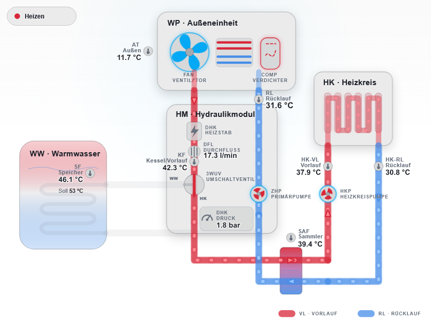
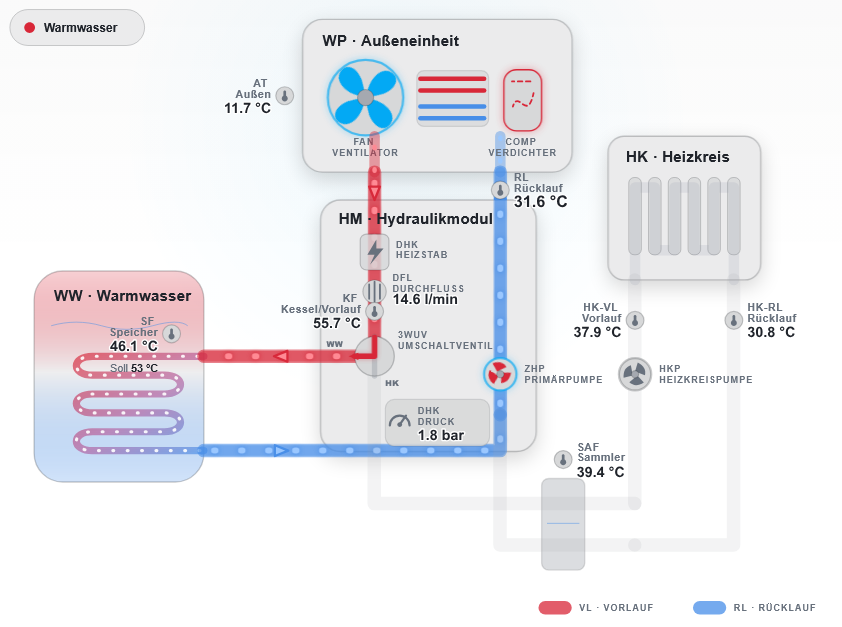

# WOLF Heat Pump Flow Card

English | [Deutsch](README.de.md)

A modern, responsive, read-only custom card for Home Assistant. It presents the hydraulic layout of a WOLF heat pump system as a self-contained SVG diagram.

The card can visualize, among other things:

- heating, domestic hot water, cooling, defrost, fault, and idle modes
- active supply and return paths, including flow direction
- the heat pump, hydraulic module, domestic hot-water tank, system collector, and heating circuit
- pumps, compressor, fan, auxiliary heater, and diverter valves
- temperatures, flow rate, system pressure, power, COP, modulation, and frequency
- technical, friendly, or combined labels
- Home Assistant light and dark themes

All entity roles are optional and can be assigned to existing Home Assistant entities in the visual card editor. The card does not send data to external services and does not call Home Assistant services to control devices.

## Preview

### Heating mode



### Domestic hot-water mode



## Compatibility

The card has been tested with Home Assistant 2026.7, but does not require that version. It uses the standard interfaces for custom dashboard cards and should therefore also work with older Home Assistant versions. If you encounter a problem with an older version, please report it through GitHub Issues.

The card is designed for WOLF systems. Entity names are not fixed; you assign the entities available in your installation during configuration.

## Installation with HACS

Installation through HACS is recommended:

1. Open **HACS** in Home Assistant.
2. Open the three-dot menu in the top-right corner and select **Custom repositories**.
3. Enter `https://github.com/flrnx23/wolf-heat-pump-flow-card` as the repository.
4. Select **Dashboard** as the category and add the repository.
5. Search HACS for **WOLF Heat Pump Flow Card** and download the card.
6. Fully reload Home Assistant in your browser or app.
7. Edit the desired dashboard, select **Add card**, and search for **WOLF Heat Pump Flow Card**.

If the card does not appear in the card picker, clear the browser cache or restart the Home Assistant app first.

## Manual installation

1. Download `dist/wolf-heat-pump-flow-card.js` from this repository.
2. Copy the file to `<config>/www/wolf-heat-pump-flow-card.js`.
3. Under **Settings → Dashboards → Resources**, add the following resource with the type **JavaScript Module**:

   ```text
   /local/wolf-heat-pump-flow-card.js
   ```

4. Reload the frontend.

## Configuration

The easiest way to add the card is through the visual card picker and then configure it in the editor. Each role can be selected directly from the entities available in Home Assistant. Leave unavailable or unnecessary roles empty.

The minimal card configuration is:

```yaml
type: custom:wolf-heat-pump-flow-card
```

Without assigned entities, the card displays only its base diagram. The following general YAML example uses deliberately generic placeholder entity IDs:

```yaml
type: custom:wolf-heat-pump-flow-card
title: Heat pump
language: en

entities:
  outdoor_temperature: sensor.heat_pump_outdoor_temperature
  heat_pump_supply_temperature: sensor.heat_pump_supply_temperature
  heat_pump_return_temperature: sensor.heat_pump_return_temperature
  system_temperature: sensor.heat_pump_system_temperature
  flow_rate: sensor.heat_pump_flow_rate
  system_pressure: sensor.heat_pump_system_pressure

  dhw_temperature: sensor.heat_pump_dhw_temperature
  dhw_target_temperature: sensor.heat_pump_dhw_target_temperature

  heating_supply_temperature: sensor.heating_circuit_supply_temperature
  heating_return_temperature: sensor.heating_circuit_return_temperature
  heating_target_temperature: sensor.heating_circuit_target_temperature

  heating_circuit_pump: binary_sensor.heating_circuit_pump
  primary_pump: binary_sensor.primary_pump
  compressor: binary_sensor.heat_pump_compressor
  auxiliary_heater: binary_sensor.heat_pump_auxiliary_heater

  fault: binary_sensor.heat_pump_fault
  heating_active: binary_sensor.heat_pump_heating
  dhw_active: binary_sensor.heat_pump_dhw
  cooling_active: binary_sensor.heat_pump_cooling
  operation_mode: sensor.heat_pump_operating_mode
  three_way_valve: sensor.heat_pump_three_way_valve
  heating_cooling_valve: sensor.heat_pump_heating_cooling_valve

  electrical_power: sensor.heat_pump_electrical_power
  thermal_power: sensor.heat_pump_thermal_power
  cop: sensor.heat_pump_cop
  compressor_modulation: sensor.heat_pump_compressor_modulation
  compressor_frequency: sensor.heat_pump_compressor_frequency

animations: true
temperature_coloring: false
show_legend: true
label_mode: friendly
layout: auto
flow_rate_threshold: 0.1

# Optional, installation-specific pressure limits in bar
system_pressure_critical_low: 1.0
system_pressure_warning_low: 1.5
system_pressure_warning_high: 2.2
system_pressure_critical_high: 2.5
```

The entity IDs shown above are examples and must be replaced with IDs from your own installation. You do not need to configure every role.

If no dedicated `cop` entity is available, the card can derive an instantaneous COP marked with `*` from thermal and electrical power, provided both values are available and use compatible units.

## Visual editor

The editor provides groups for:

- temperatures
- hydraulics, pumps, and valves
- compressor, fan, and auxiliary heater
- operating states
- performance values
- display and layout

The visual editor also provides a language dropdown for **German** and **English** (`de` and `en`). If `language` is omitted, the card follows the Home Assistant language, with the browser locale as a fallback, to preserve backward compatibility.

Status roles can be selected from `sensor`, `binary_sensor`, or `input_boolean` entities. Measurements can come from domains including `sensor`, `number`, and `input_number`. Advanced state mappings can be configured in YAML when needed.

## Configuration options

| Option                          | Type    | Default                       | Description                                                         |
| ------------------------------- | ------- | ----------------------------- | ------------------------------------------------------------------- |
| `type`                          | String  | required                      | Must be `custom:wolf-heat-pump-flow-card`.                          |
| `title`                         | String  | not set                       | Optional card title.                                                |
| `language`                      | String  | Home Assistant/browser locale | `de` or `en`; overrides the language used for built-in card labels. |
| `entities`                      | Object  | empty                         | Assigns entities to the optional entity roles.                      |
| `animations`                    | Boolean | `true`                        | Animates active pipes and components.                               |
| `temperature_coloring`          | Boolean | `false`                       | Enables optional temperature-based pipe coloring.                   |
| `show_legend`                   | Boolean | `true`                        | Shows the supply and return legend.                                 |
| `label_mode`                    | String  | `friendly`                    | `technical`, `friendly`, `both`, or `hidden`.                       |
| `layout`                        | String  | `auto`                        | `auto`, `compact`, or `wide`.                                       |
| `flow_rate_threshold`           | Number  | `0.1`                         | Minimum absolute flow rate considered measured flow.                |
| `system_pressure_critical_low`  | Number  | not set                       | Critical lower system-pressure limit in bar.                        |
| `system_pressure_warning_low`   | Number  | not set                       | Lower warning limit for system pressure in bar.                     |
| `system_pressure_warning_high`  | Number  | not set                       | Upper warning limit for system pressure in bar.                     |
| `system_pressure_critical_high` | Number  | not set                       | Critical upper system-pressure limit in bar.                        |
| `state_mapping`                 | Object  | built-in mapping              | Raw values for active and inactive binary states.                   |
| `operation_mode_mapping`        | Object  | built-in mapping              | Raw values for operating modes.                                     |
| `three_way_valve_mapping`       | Object  | built-in mapping              | Raw values for the heating/domestic-hot-water diverter valve.       |
| `heating_cooling_valve_mapping` | Object  | built-in mapping              | Raw values for the heating/cooling diverter valve.                  |

The `language` option affects only the displayed labels. Entity IDs and raw values supplied by integrations remain unchanged.

`valve_mapping` remains available as a compatibility alias for `three_way_valve_mapping`. Use `three_way_valve_mapping` for new configurations.

With `layout: auto`, the diagram follows the card width that is actually available: up to 520 pixels it uses the dedicated portrait geometry, and above that it uses the wide hydraulic diagram. `compact` and `wide` force the corresponding variant regardless of the dashboard column width.

The pressure limits are entirely optional. Once `system_pressure` and suitable limits are configured, the card marks warning ranges in yellow and critical ranges in red, both in the hydraulic diagram and in the measurement panel. The limits must follow the order `critical low ≤ warning low ≤ warning high ≤ critical high`. Suitable values depend on the specific hydraulic system and the installer's requirements; the example values are not a general recommendation.

## Supported entity roles

All roles are optional.

| Role                           | Purpose                                        |
| ------------------------------ | ---------------------------------------------- |
| `outdoor_temperature`          | Outdoor temperature                            |
| `heat_pump_supply_temperature` | Boiler/supply temperature in the indoor module |
| `heat_pump_return_temperature` | Heat-pump return temperature                   |
| `system_temperature`           | System or collector temperature                |
| `flow_rate`                    | Current flow rate                              |
| `system_pressure`              | Current system pressure                        |
| `dhw_temperature`              | Domestic hot-water tank temperature            |
| `dhw_target_temperature`       | Domestic hot-water target temperature          |
| `heating_supply_temperature`   | Heating-circuit supply temperature             |
| `heating_return_temperature`   | Heating-circuit return temperature             |
| `heating_target_temperature`   | Heating-circuit target temperature             |
| `heating_circuit_pump`         | Heating-circuit pump                           |
| `primary_pump`                 | Primary or feeder pump                         |
| `compressor`                   | Compressor status                              |
| `fan`                          | Fan status                                     |
| `fan_speed`                    | Fan speed                                      |
| `auxiliary_heater`             | Electric auxiliary heater                      |
| `defrost_active`               | Explicit defrost status                        |
| `fault`                        | Fault status or numeric error code             |
| `heating_active`               | Heating demand                                 |
| `dhw_active`                   | Domestic hot-water status                      |
| `cooling_active`               | Explicit cooling status                        |
| `operation_mode`               | Overall operating mode                         |
| `three_way_valve`              | Heating/domestic-hot-water diverter valve      |
| `heating_cooling_valve`        | Heating/cooling diverter valve                 |
| `electrical_power`             | Current electrical power                       |
| `thermal_power`                | Current thermal power                          |
| `cop`                          | Current COP                                    |
| `compressor_modulation`        | Current compressor modulation                  |
| `compressor_frequency`         | Current compressor frequency                   |

## State mappings

Integrations provide status values in different languages and spellings. The card normalizes capitalization, whitespace, punctuation, separators, and German umlauts. You can define custom lists in YAML when an integration uses different raw values:

```yaml
type: custom:wolf-heat-pump-flow-card
entities:
  operation_mode: sensor.heat_pump_operating_mode
  compressor: binary_sensor.heat_pump_compressor

state_mapping:
  active: ["on", "running"]
  inactive: ["off", "idle"]

operation_mode_mapping:
  heating: ["heating"]
  dhw: ["dhw"]
  cooling: ["cooling"]
  defrost: ["defrost"]
  fault: ["fault"]
  idle: ["idle"]
```

A custom list replaces the corresponding default list. Each overridden list must therefore include every raw value you still want the card to recognize.

## Mode, flow, and direction logic

The card determines the operating mode from the configured fault, defrost, operating-mode, demand, and valve entities. Fault and defrost take precedence over normal operating modes.

When the hydraulic system is active, the card displays water flow and direction. Every relevant supply and return segment has a direction arrow and a CSS-based particle animation.

- A flow rate above `flow_rate_threshold`, or an active primary pump, activates primary flow.
- If neither a flow-rate value nor pump states are available, an active operating mode can be used as a fallback.
- An available flow-rate value of `0`, or an explicitly inactive pump, prevents animation based only on an operating mode.
- A negative signed flow rate reverses the arrows and particle direction on active segments.
- The heating-circuit pump controls the outer heating circuit separately.
- `animations: false` stops movement while keeping state, direction arrows, and colors visible.
- The system **Reduce motion** preference is respected.

By default, the card uses unambiguous semantic colors: red for supply and blue for return. This keeps flow direction easy to identify even on small screens. Set `temperature_coloring: true` to use temperature-dependent colors for active pipes instead. The coil in the domestic hot-water tank deliberately retains a supply-to-return gradient because it represents a heat exchanger.

Set `show_legend: false` to hide the supply/return legend independently of all other labels.

## Missing and invalid values

The card handles incomplete data defensively:

- Missing entities do not break the card or its layout.
- `unknown`, `unavailable`, empty states, and invalid numbers are not interpreted as `0`.
- Unassigned or currently unavailable measurements are not displayed.
- Units are taken from `unit_of_measurement`.
- Numbers using a German decimal comma are accepted.
- Missing optional status entities do not create invented states.

Clicking or pressing a key on an assigned sensor or component opens Home Assistant's **More info** dialog. If no entity is assigned, the diagram remains purely informational.

## License

[MIT](LICENSE)
